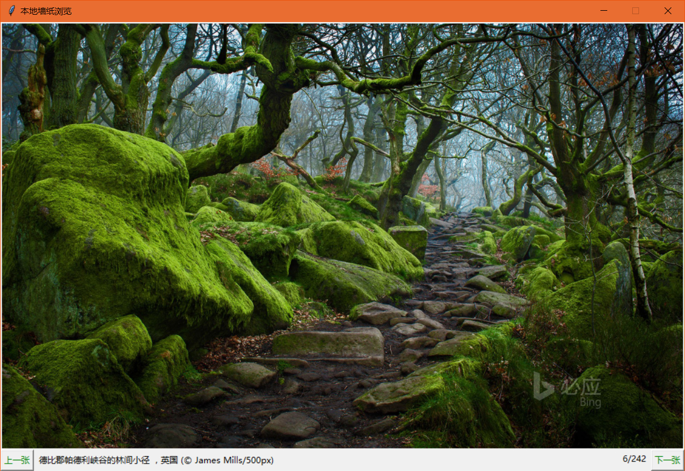

# dlbingwallpaper
下载必应(cn.bing.com)壁纸。

# 使用
命令行切换到脚本所在目录，并执行：

>`>>>python dlbingwallpaper.py DOWNLOAD_PATH`

例如：

>`>>>python dlbingwallpaper.py E:\wallpapers`

你也可以将脚本的快捷方式放入系统的Startup下并设置启动参数，作为开机自启动项目。

所有的图片信息保存在数据库wallpaper.db中，可以使用SQLiteStudio查看。

# 用setup.vbs部署
双击setup.vbs：
1. 程序获取环境变量`Path`中的Python解释器路径，并弹出窗口显示；
2. 设置脚本的安装路径；
3. 设置下载墙纸的保存路径；
4. 提示：“安装完成！”。

之后，每次开机时会自动下载壁纸。

# 图形界面
安装完成后，会在桌面找到 wallpaperbrowser 图标，打开后界面如下：

## 功能
1. 在图片上单击鼠标右键，有打开墙纸保存路径的选项；
2. 在图片上双击鼠标左键，用系统默认的墙纸浏览器打开图片；
3. 最下方显示墙纸的描述信息；
4. 支持键盘左右方向键翻页

# 注意
脚本使用`Python 3`